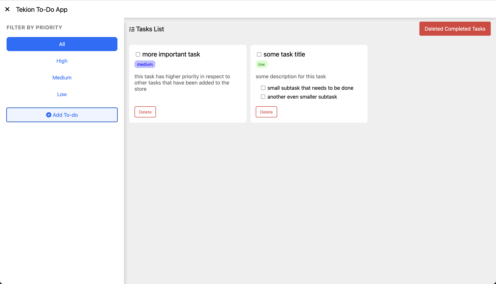
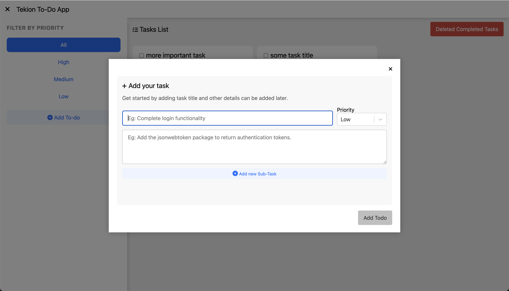
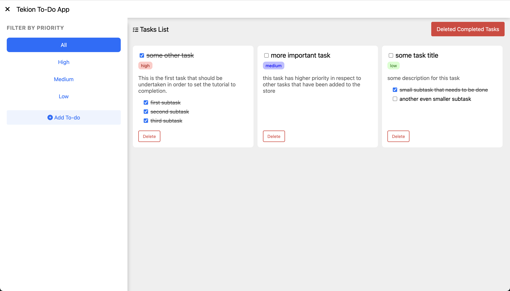

# Todo App

This is the basic react app created with the purpose of learning the basics of React development. Through this project I got to learn about following concepts majorly -

1. App architecture that is used for building large-scale websites.
2. Learnt about `useState` react hook, and how the changes on the UI are handled.
3. Learnt about several packages/libraries that are widely used for React development, which include [lodash](https://lodash.com), [react-modal](https://www.npmjs.com/package/react-modal), etc.
4. Learnt about styling using [Bootstrap](https://getbootstrap.com/), focusing mainly 12 column-grid that helps making the app scalable.
5. Got to learn a little bit about `flex` property of css.

## Features

1. **CRUD** operations on tasks.
2. Each task can have several **sub-tasks**, and completion of all the subtasks results into completion of the complete task.
3. Each task can have **priorities** as low, medium, and high, and we can have the tasks filtered on the basis of priority.
4. New tasks are added using the Modal, and the default priority is set depending upon the tab user currently is in.

## Screenshots

